### Open source hyerledger projects
---

 
 

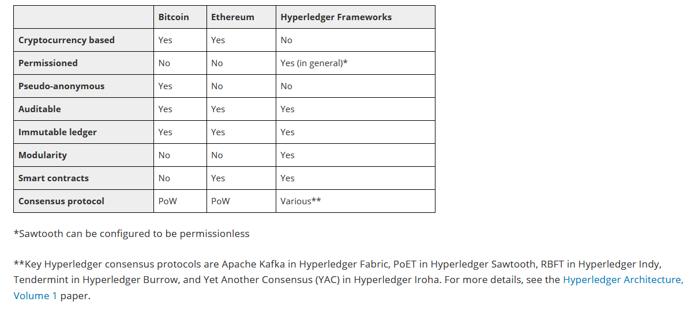

 

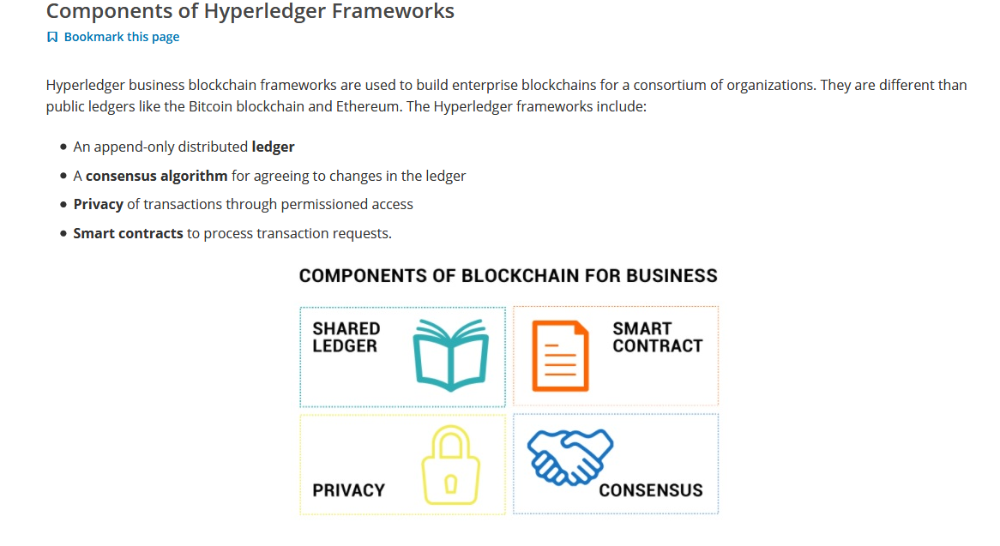

 

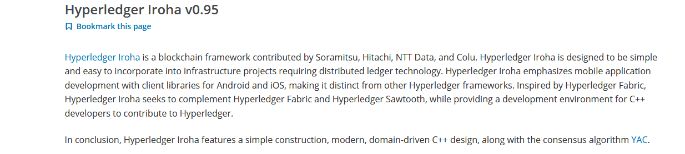

 

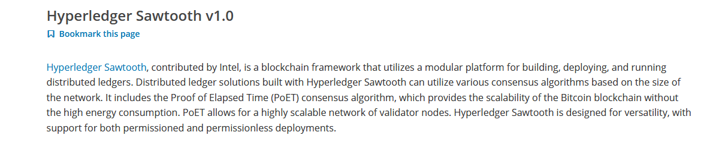

 

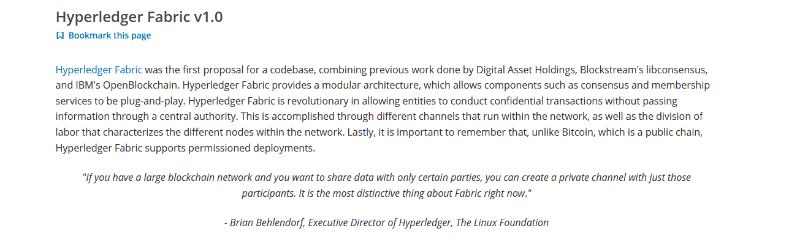

 

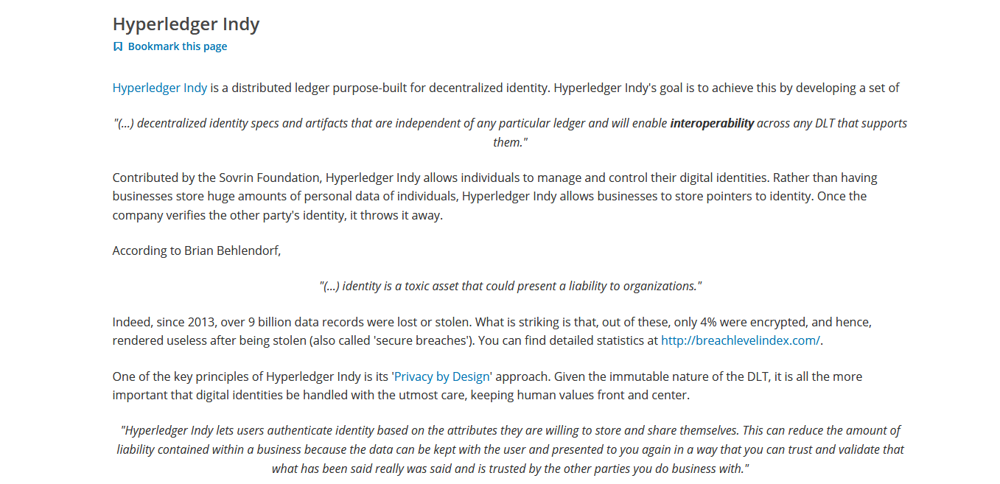

 

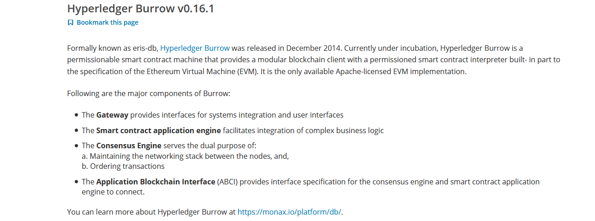

  
  

### Modules

Modules are auxiliary softwares used for things like deploying and maintaining blockchains, examining the data on the ledgers, as well as tools to design, prototype, and extend blockchain networks.

   

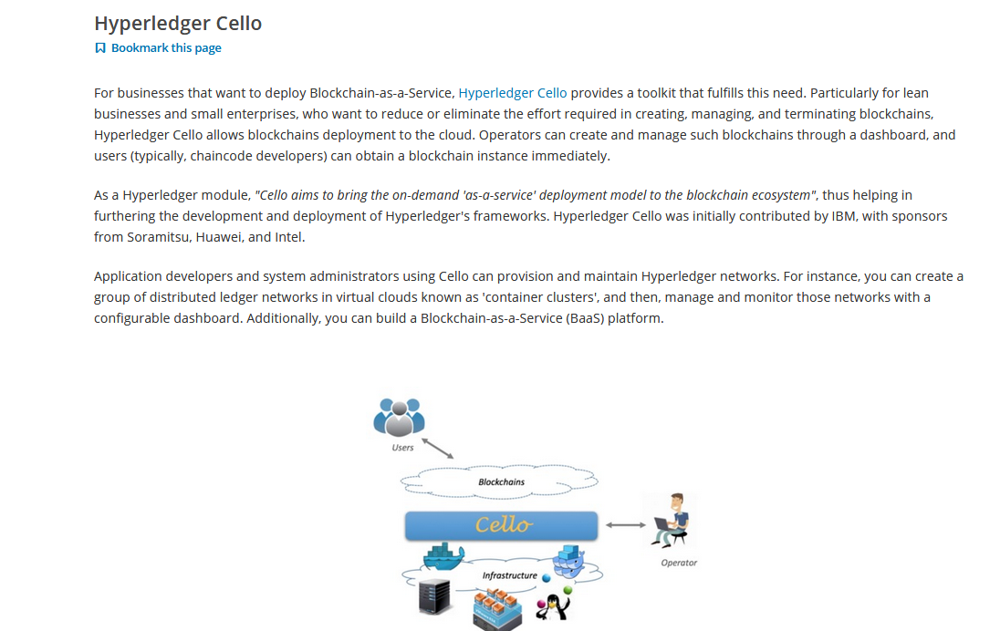

 

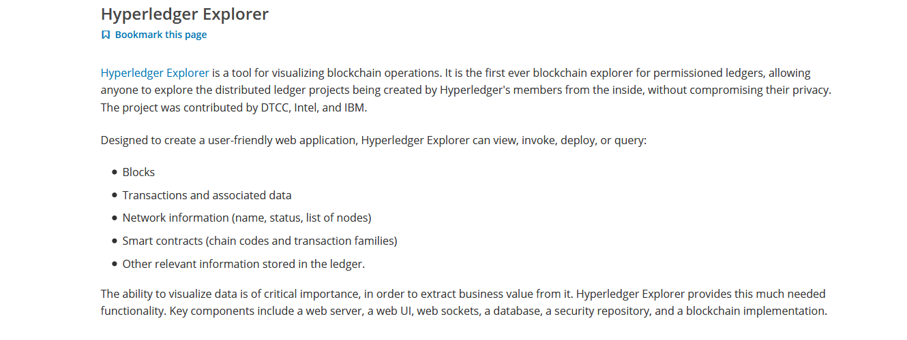

 

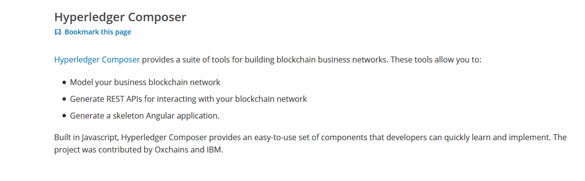

 

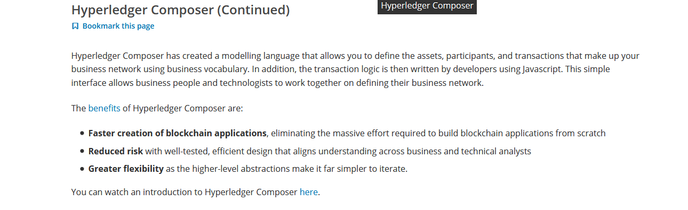

 